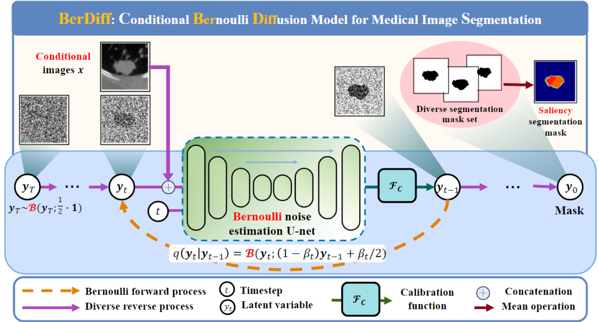

# BerDiff: Conditional Bernoulli Diffusion Model for Medical Image Segmentation
This is the official implementation of the paper "BerDiff: Conditional Bernoulli Diffusion Model for Medical Image Segmentation" at the 26th International Conference on Medical Image Computing and Computer-Assisted Intervention (MICCAI 2023). The pre-print version can be found in [arxiv](https://arxiv.org/abs/2304.04429); a camera-ready version will be soon released.

## Updates
Dec 2023: initial commit.  

## Approach


## Data Preparation
The LIDC-IDRI dataset can be downloaded from [data link](https://pantheon.corp.google.com/storage/browser/hpunet-data/lidc_crops). It is preprocessed and given by [Probabilistic UNet](https://github.com/SimonKohl/probabilistic_unet)

#### Dataset structure:
```
LIDC/
  |--train/
      |--images/
        |--LIDC-IDRI-0001/
          |--z-105.0_c0.png
          |--z-107.0_c0.png
          ...
        |--LIDC-IDRI-0001/
        ...
      |--gt/
        |--LIDC-IDRI-0001/
          |--z-105.0_c0_l0.png
          |--z-105.0_c0_l1.png
          |--z-105.0_c0_l2.png
          |--z-105.0_c0_l3.png
          |--z-107.0_c0_l0.png
          |--z-107.0_c0_l1.png
          |--z-107.0_c0_l2.png
          |--z-107.0_c0_l3.png
          ...
        |--LIDC-IDRI-0001/
        ...
  |--val/
  |--test/
      |--quarter_1mm
      |--full_1mm
```

## Requirements
```
- Linux Platform
- torch==1.12.1+cu102 # depends on the CUDA version of your machine
- torchvision==0.13.1+cu102
- Python==3.9.7
- numpy==1.21.2
- blobfile==2.0.0
- argparse==1.4.0
```

## Citation
If you find our work and code helpful, please kindly cite the corresponding paper:
```
@article{chen2023ascon,
  title={BerDiff: Conditional Bernoulli Diffusion Model for Medical Image Segmentation},
  author={Chen, Tao and Wang, Chenhui and Shan, Hongming},
  journal={MCCAI 2023},
  year={2023}
}
```
